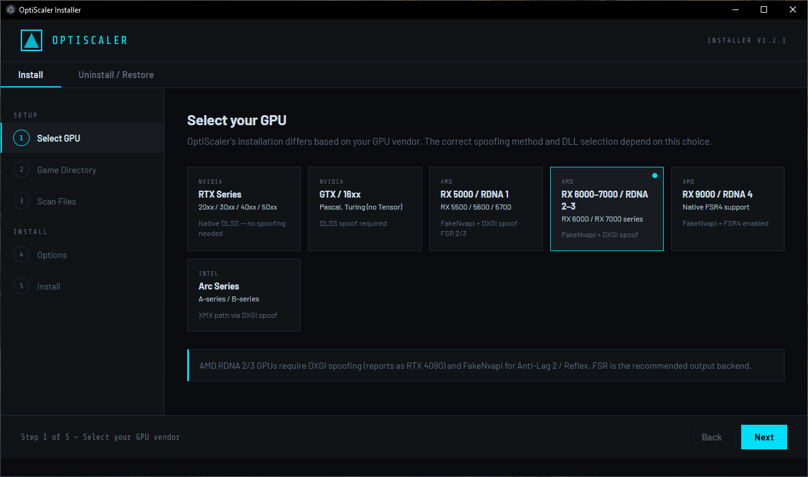
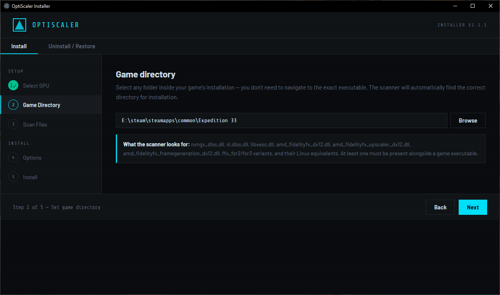
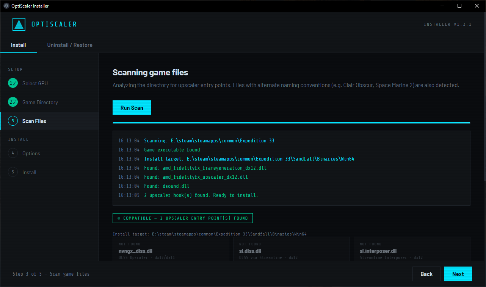
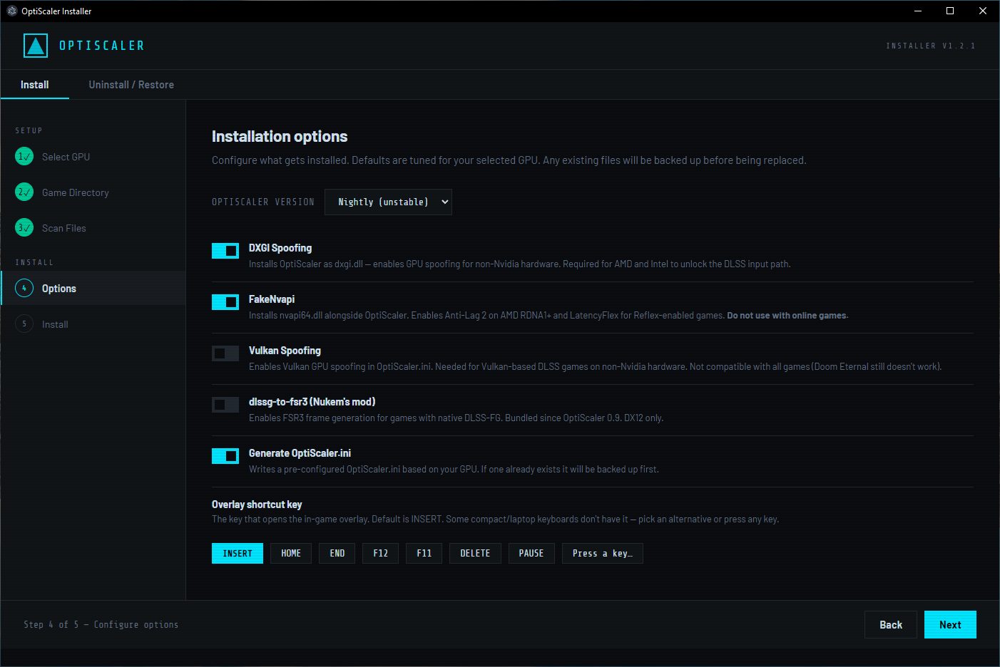
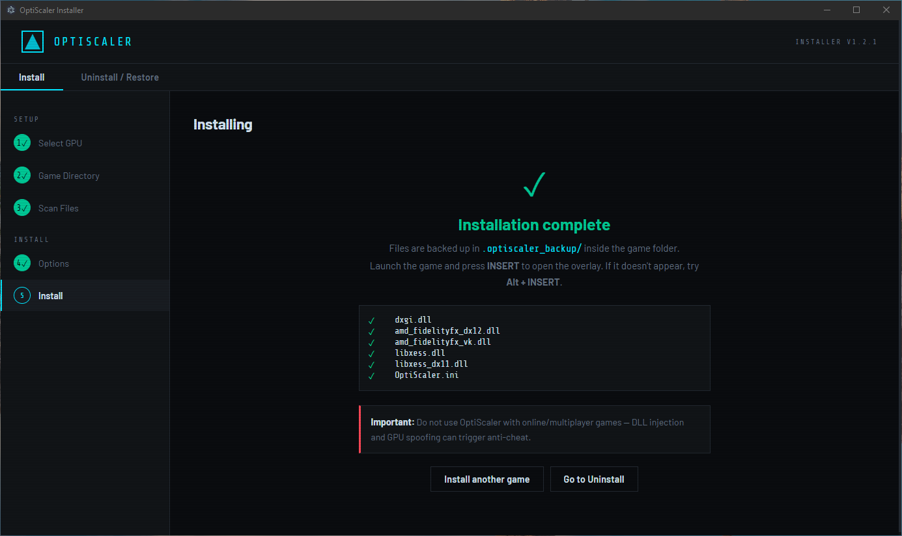
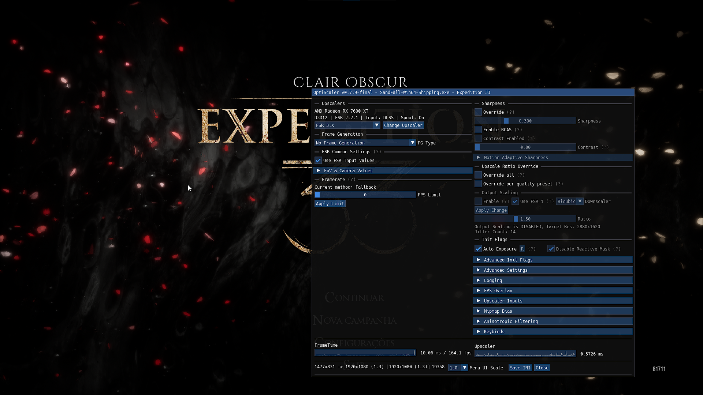
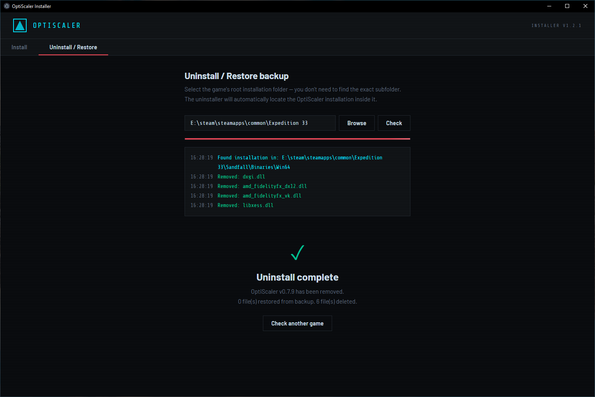

# How to Use OptiScaler Installer

> **Before you start:** OptiScaler requires a game that already ships with DLSS 2+, XeSS, or FSR 2+. The scanner will tell you if your game is compatible.

---

## Step 1 — Select your GPU

Open OptiScaler Installer and select your GPU from the list. Only GPUs listed are supported. Once selected, click **Next**.

---

## Step 2 — Select the game folder

Point to the game's installation directory. You don't need to navigate to the exact folder where the executable is — the tool will find the correct location automatically. Click **Next**.

---

## Step 3 — Scan

Click **Run Scan**. The tool will check whether the game has the DLLs required for OptiScaler to work. If compatible files are found, they will be listed. Click **Next** to continue.

> If the scan finds no compatible DLLs, the game likely doesn't support DLSS, XeSS, or FSR — OptiScaler won't be able to hook into it.

---

## Step 4 — Configure options

Choose your preferred OptiScaler version and which features to enable. You can also pick the keyboard shortcut that will open the OptiScaler overlay in-game.

> Only the **Latest stable** version is currently recommended for installation. Nightly builds are unstable and may have issues.

Click **Next** when done.

---

## Step 5 — Install

Click **Start Installation**. The installer will download OptiScaler from GitHub and install it into your game folder. Any existing files that need to be replaced will be backed up automatically before being overwritten.

Do not close the window until the installation is complete.

---

## Step 6 — Launch your game

Start your game and press the shortcut key you selected in Step 4 to open the OptiScaler overlay.

> If the overlay doesn't appear, try **Alt + [your shortcut key]**.

---

## Uninstalling

If you need to remove OptiScaler, go to the **Uninstall / Restore** tab and select the game folder. The tool will automatically detect what was installed and remove it. Any original game files that were backed up during installation will be restored to their original location.
