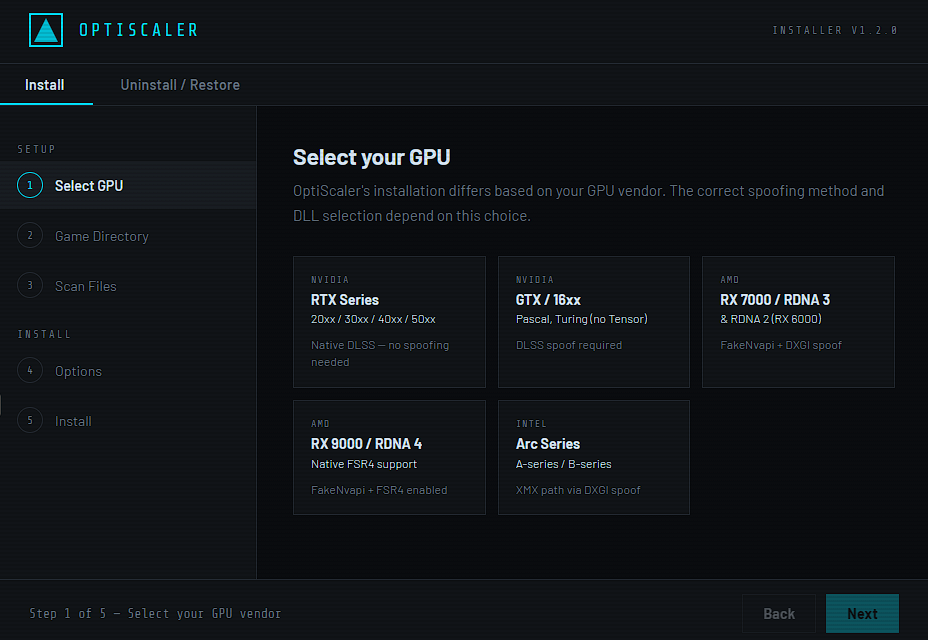

# OptiScaler Installer

A cross-platform GUI for installing [OptiScaler](https://github.com/optiscaler/OptiScaler) into games on Windows and Linux. Built with Electron — no server, no dependencies at runtime beyond the app itself.



## What it does

1. You pick your GPU vendor (Nvidia RTX/GTX, AMD RDNA 2/3/4, Intel Arc).
2. You point it at a game directory.
3. It scans for upscaler entry points (`nvngx_dlss.dll`, `libxess.dll`, `amd_fidelityfx_dx12.dll`, etc.).
4. If compatible files are found, it downloads the correct OptiScaler release from GitHub, copies the right DLLs, and generates a pre-tuned `OptiScaler.ini`.

### Spoofing logic per GPU

| GPU | Entry DLL | DXGI spoof | FakeNvapi | Notes |
|-----|-----------|------------|-----------|-------|
| Nvidia RTX | `nvngx.dll` | off | off | Native DLSS path |
| Nvidia GTX/16xx | `dxgi.dll` | on | off | Spoof needed for DLSS |
| AMD RDNA 2/3 | `dxgi.dll` | on | on | Anti-Lag 2 via FakeNvapi |
| AMD RDNA 4 | `dxgi.dll` | on | on | FSR4 native + spoof for DLSS input |
| Intel Arc | `dxgi.dll` | on | off | Activates XMX path for XeSS |

### Important: online games

**Do not install OptiScaler into online or multiplayer games.** GPU spoofing and DLL injection can trigger anti-cheat software. This installer does not enforce this restriction — that's your responsibility.

---

## Development setup

### Requirements

- Node.js 18+ ([nodejs.org](https://nodejs.org))
- npm 9+
- Git

On Linux, also install `unzip` if it isn't already present (`apt install unzip` or equivalent).  
On Windows, `Expand-Archive` (PowerShell built-in) is used instead.

### Install dependencies

```bash
git clone https://github.com/dario-gms/OptiScaler-Installer
cd OptiScaler-Installer
npm install
```

### Run in development

```bash
npm start
```

This opens the Electron window. The `window.electronAPI` bridge is active, so folder browsing, scanning, and installation all work against the real filesystem.

---

## Building releases

`electron-builder` handles packaging. Outputs go to `dist/`.

### Windows (from a Windows machine or CI)

```bash
npm run build:win
```

Produces:
- `dist/OptiScaler Installer Setup 1.0.0.exe` — NSIS installer
- `dist/OptiScaler Installer 1.0.0.exe` — portable single-file exe

### Linux (from a Linux machine or CI)

```bash
npm run build:linux
```

Produces:
- `dist/OptiScaler Installer-1.0.0.AppImage` — portable, runs on any x64 distro
- `dist/optiscaler-installer_1.0.0_amd64.deb` — Debian/Ubuntu package

### Both at once

```bash
npm run build:all
```

---

## Automated releases with GitHub Actions

This project uses GitHub Actions to automatically build and create releases.

### Workflow overview

The workflow (`.github/workflows/build.yml`) is triggered on every tag push matching `v*`:

```bash
git tag v1.0.1
git push origin v1.0.1
```

**What happens automatically:**
1. ✅ Windows build runs on `windows-latest`
2. ✅ Linux build runs on `ubuntu-latest`
3. ✅ Both builds upload their artifacts
4. ✅ Release is created with all files attached (`.exe`, `.AppImage`, `.deb`, etc.)

### Workflow file

`.github/workflows/build.yml` configuration:

```yaml
name: Build and Release

on:
  push:
    tags:
      - 'v*'

jobs:
  build:
    runs-on: ${{ matrix.os }}
    strategy:
      matrix:
        os: [windows-latest, ubuntu-latest]
    # ... build steps ...

  release:
    needs: build
    runs-on: ubuntu-latest
    permissions:
      contents: write
    # ... release steps with skip_existing: true ...
```

**Key points:**
- Builds run in **parallel** for Windows and Linux
- Release job **waits for both builds** to complete
- `skip_existing: true` prevents errors if re-running the workflow

### Creating a release

```bash
# 1. Commit your changes
git add .
git commit -m "your message"
git push

# 2. Create and push a tag
git tag v1.0.2
git push origin v1.0.2
```

That's it! GitHub Actions will build and release automatically. Check the **Actions** tab to monitor progress.

---

## Project structure

```
optiscaler-installer/
├── main.js          # Electron main process — IPC handlers, filesystem ops, download logic
├── preload.js       # Context bridge — exposes electronAPI to renderer safely
├── index.html       # Entire UI (HTML/CSS/JS, no bundler needed)
├── package.json     # npm + electron-builder config
├── assets/
│   ├── icon.ico     # Windows icon (256x256 recommended)
│   └── icon.png     # Linux icon (512x512 recommended)
└── .github/
    └── workflows/
        └── build.yml
```

The UI has no external CSS or JS dependencies — intentional. Keeping it self-contained means no bundler, no node_modules leaking into the renderer, and a faster iteration loop.

---

## Adding icons

Place a 256×256 `icon.ico` (Windows) and 512×512 `icon.png` (Linux) in `assets/`. electron-builder picks them up automatically from the `build.win.icon` and `build.linux.icon` paths in `package.json`.

Tools to generate `.ico` from PNG: [ImageMagick](https://imagemagick.org/) or [icoutils](https://www.nongnu.org/icoutils/).

```bash
convert icon.png -resize 256x256 icon.ico
```

---

## How the scan works

`main.js` walks up to 3 directory levels from the game path, looking for files matching the known upscaler DLL list. It restricts recursion to directories named `bin`, `binaries`, `win64`, `win32`, `x64`, `game`, and `engine` to avoid scanning entire drives.

A scan passes (`Compatible`) when:
- At least one `.exe` file is found in the root directory, and
- At least one known upscaler entry point DLL is present anywhere in the scanned tree.

If neither condition is met, the installer blocks progression and shows an explanation.

---

## License

MIT. See `LICENSE`.

This project is not affiliated with the OptiScaler team. It is a community-made installer that fetches OptiScaler directly from the [official GitHub releases](https://github.com/optiscaler/OptiScaler/releases).

### v1.2.0
- **Automatic backup before overwrite** — Before replacing any file, the installer copies the original to `.optiscaler_backup/` inside the game folder. A `optiscaler_manifest.json` records exactly what was installed and what was backed up.
- **Uninstall / Restore tab** — New top-level tab. Point it at the game directory, click Check, and it reads the manifest to show you exactly what will be restored vs deleted. Click Uninstall & Restore to undo everything the installer did.
- **Expanded scan targets** — Scanner now detects alternate FSR naming conventions used by games like Clair Obscur (`amd_fidelityfx_upscaler_dx12.dll`, `amd_fidelityfx_framegeneration_dx12.dll`) and legacy FSR2/FSR3 API DLL names (`ffx_fsr2_api_dx12_x64.dll`, `ffx_fsr3upscaler_x64.dll`, `ffx_framegeneration_x64.dll`, `sl.interposer.dll`).
- Scan results now filter out non-trigger "not found" entries to reduce noise — only relevant missing files are shown.
- After a successful install, a shortcut button to "Go to Uninstall" is shown on the completion screen.
